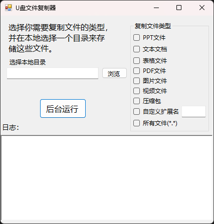

### 作者已跑路，项目文件中的 USB-files-copy1.2.7z 文件是程序最新版本(V1.2)源代码，有大量未知BUG，作者在发布1.2版本之前以尽所能及修复了部分BUG，但是否有效未知（未进行相关测试），建议不要把自己常用的U盘来用作测试（上一次测试由于BUG导致U盘文件全部被删，不知在改BUG时修改的代码有没有效），相关程序文件在latest中见相关文件描述，剩下的就交给开源社区的同志们来完善了，如果后面如果有机会的话可能还会发布新版本，但是1.2版本目前来看应该是最后一个BUG数量最多的版本。
# 禁止用于商业
# 禁止用于窃取包括但不限于国家机密，商业机密
## U盘文件复制工具

## 界面说明

### 主界面布局(1.2版本之前的界面)

窗体分为三个主要区域：
1. **左侧控制面板**
   - 操作说明标签
   - 目录选择文本框
   - 浏览按钮
   - 后台运行按钮

2. **右侧文件类型选择**
   - 文件类型复选框组（GroupBox）
   - 全选/自定义扩展名选项

3. **底部日志区域**
   - 实时显示错误信息
   - 自动保留历史记录

### 控件详细说明

#### 文件类型选择（右侧面板）
| 控件名称      | 类型   | 说明                                                                 |
|---------------|--------|----------------------------------------------------------------------|
| checkBox1     | 复选框 | PPT文档（*.ppt, *.pptx）                                            |
| checkBox2     | 复选框 | Word文档（*.doc, *.docx, *.txt）                                    |
| checkBox3     | 复选框 | Excel文档（*.xlsx, *.xls）                                          |
| checkBox4     | 复选框 | PDF文档（*.pdf）                                                    |
| checkBox5     | 复选框 | 图片文件（*.jpg, *.png等6种格式）                                    |
| checkBox6     | 复选框 | 视频文件（*.mp4, *.avi等6种格式）                                    |   
| checkBox10    | 复选框 | 音频文件（*.mp3, *.wav等6种格式）                                    |
| checkBox9     | 复选框 | 压缩文件（*.zip, *.rar等15种格式）                                   |
| checkBox7     | 复选框 | 自定义扩展名（需在文本框输入）                                       |
| textBox1      | 文本框 | 输入自定义扩展名（示例：psd,ai 不需要加*号和点）                     |
| checkBox8     | 复选框 | 全选模式（选中时禁用自定义文本框）                                   |

#### 目录设置（左侧面板）
| 控件名称      | 类型   | 说明                                                                 |
|---------------|--------|----------------------------------------------------------------------|
| textBox2      | 文本框 | 显示已选择的存储路径                                                 |
| button2       | 按钮   | 打开文件夹浏览对话框                                                 |
| button1       | 按钮   | 最小化到系统托盘（后台运行模式）                                     |

#### 日志显示区域
| 控件名称      | 类型         | 特性                                                                 |
|---------------|--------------|----------------------------------------------------------------------|
| richTextBox1  | 富文本框     | 自动滚动、保留900行历史记录、彩色日志支持                            |
| label1        | 标签         | 固定显示"日志："标题                                                 |

## 新增操作说明

### 自定义扩展名规范
1. 多个扩展名用**英文逗号**分隔
2. 不需要添加通配符（示例正确：cad,dwg 示例错误：*.cad, .dwg）
3. 最大支持15个自定义扩展名
4. 需要勾选"自定义扩展名"复选框生效

### 日志系统特性
- 三重日志记录：
  1. 界面实时显示（只显示错误信息）
  2. 文件存储（目标目录/CopyLog.txt，显示所有复制信息）

## 界面交互细节

### 智能状态联动
- 勾选"所有文件(*.*)"时：
  - 自动选中所有文件类型复选框
  - 禁用自定义扩展名文本框
  - 忽略其他复选框状态

- 自定义扩展名：
  - 勾选时自动聚焦文本框
  - 文本框失去焦点时自动去除空格
  - 输入非法字符时自动过滤

## 注意事项

1. 窗口关闭按钮实际执行最小化到托盘
2. 系统托盘图标右键菜单包含：
   - 显示主界面
   - 退出程序
3. 目标路径显示框支持直接粘贴路径

